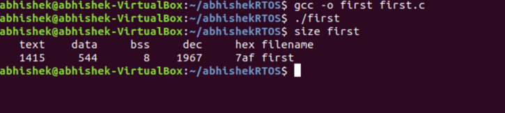
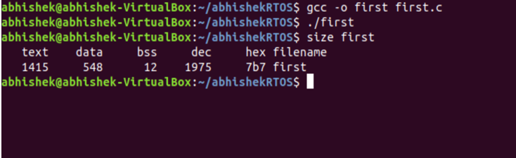
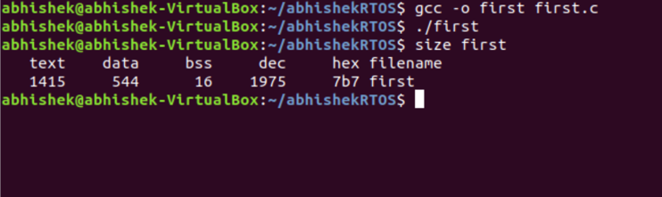
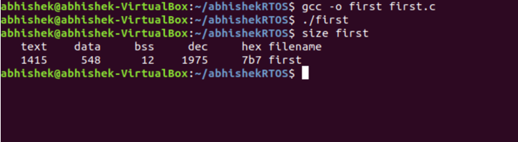
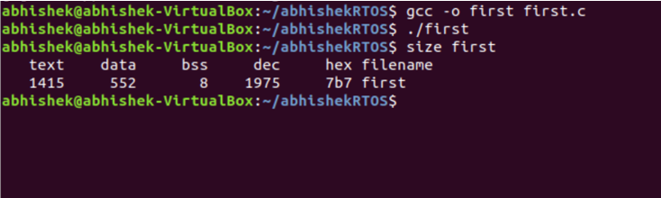
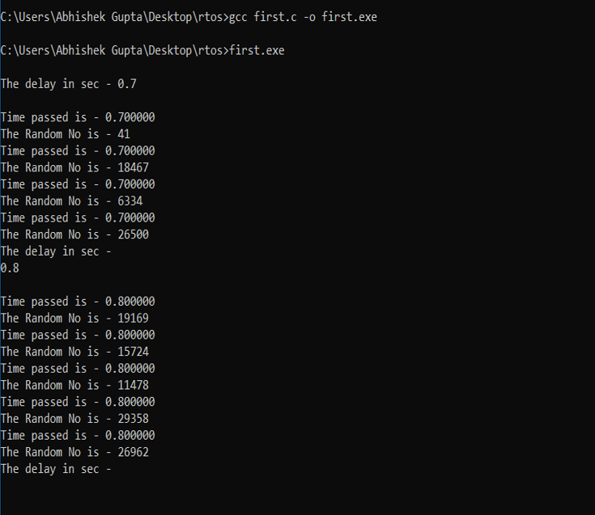

# RTOS-C-Programs
This repository explains about how to print memory map of the system and random number after a certain amount of delay using C.

## (1) Memory Map in C
This code explains about how to print the memory map of the system using the C code.

Outpts:-

(A)-

(B)-

(C)-

(D)-

(E)-

## (2) Time Delay in C
This code explains about how to create a loop which prints a random number after a certain amount of delay. The Value of the delay will be provided by the user. The Delay function gets an interrupt whenever any key press in there.

Output:-

